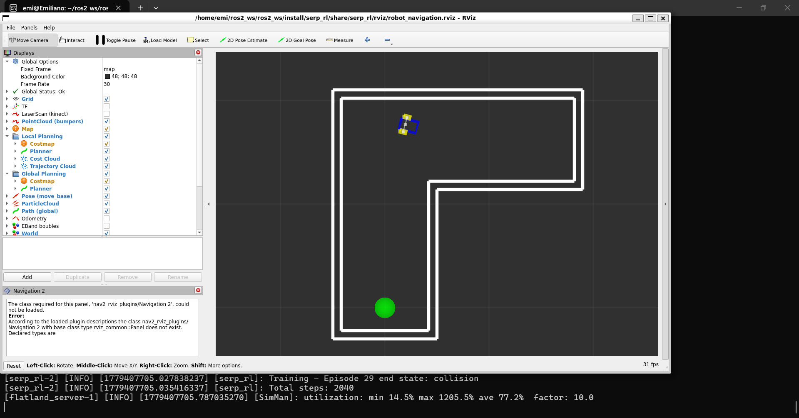
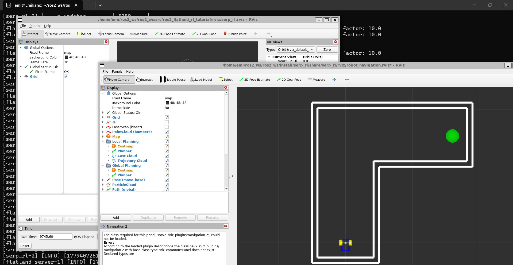
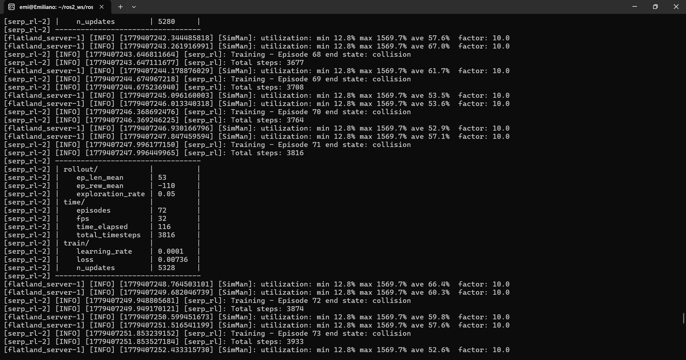
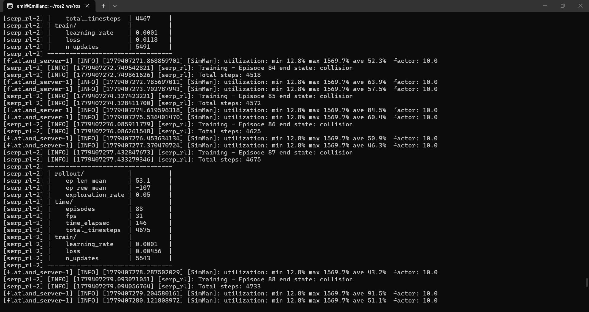
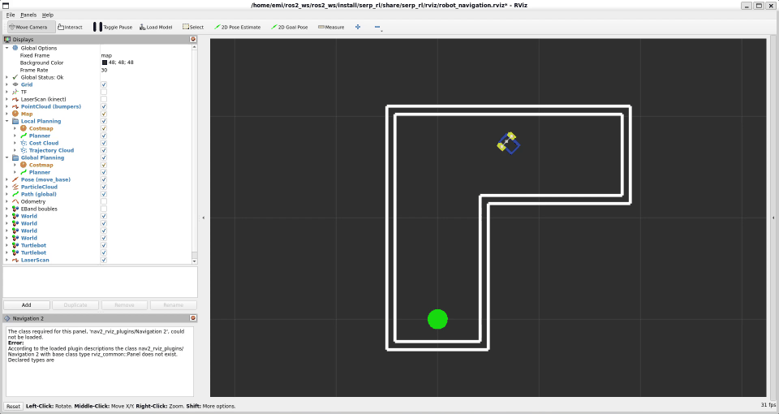
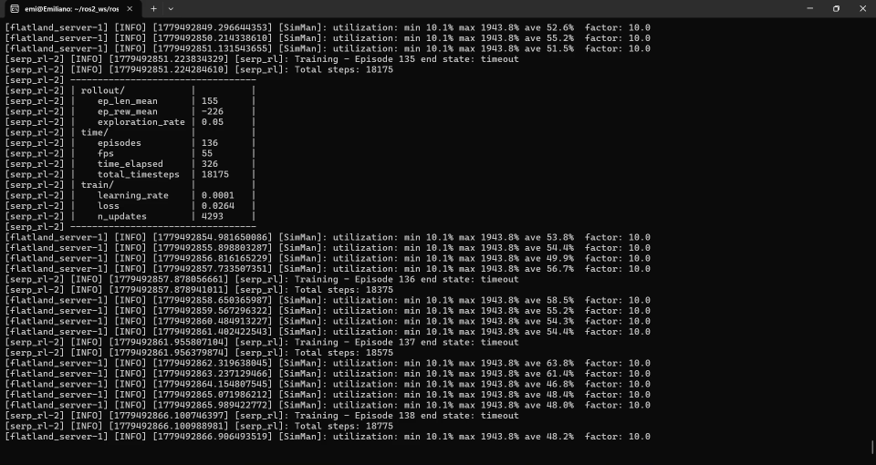

# Reinforcement Learning con DQN en ROS2 Flatland

## Descripción
Implementación de un algoritmo de Reinforcement Learning diferente a PPO para entrenar
al robot SERP a navegar un pasillo con giro de 90° usando ROS2 y el simulador Flatland.

## Algoritmo seleccionado: DQN (Deep Q-Network)

Se seleccionó **DQN** en lugar de PPO por las siguientes razones técnicas:

- El entorno tiene un **espacio de acción discreto** (3 acciones: avanzar, girar izquierda,
  girar derecha). SAC y TD3 no son compatibles con acciones discretas, por lo que DQN
  es la elección correcta.
- DQN usa **exploración epsilon-greedy**: al inicio toma acciones casi aleatorias
  (`exploration_rate ≈ 0.65`) y gradualmente las reduce (`exploration_rate → 0.05`)
  a medida que aprende, lo que permite una exploración más balanceada que A2C.
- DQN es **off-policy** y usa un **replay buffer**, lo que lo hace más sample-efficient
  que algoritmos on-policy como PPO o A2C.

## Cambio realizado en el código

Archivo modificado: `serp_rl/serp_rl/__init__.py`

**Línea 18** — Importación del algoritmo:
```python
# Original
from stable_baselines3 import PPO

# Modificado
from stable_baselines3 import DQN
```

**Línea 274** — Creación del agente:
```python
# Original
agent = PPO("MlpPolicy", self, verbose=1)

# Modificado
agent = DQN("MlpPolicy", self, verbose=1,
            learning_starts=1000,
            buffer_size=50000,
            exploration_fraction=0.3)
```

El parámetro `learning_starts=1000` indica que DQN espera acumular 1000 experiencias
en el replay buffer antes de comenzar a actualizar la red, lo que estabiliza el
aprendizaje inicial.

## Mejoras adicionales implementadas

### 1. Función de recompensa mejorada

Se modificó la función `step()` para incluir recompensas diferenciadas por estado
y una recompensa continua basada en la distancia al objetivo:

```python
if self.collision:
    reward = -200.0          # Penalización fija por colisión

elif self.distance_to_end < self.end_range:
    reward = 400.0           # Recompensa fija por llegar al objetivo

elif self.step_number >= self.max_steps:
    reward = -300.0          # Penalización fija por timeout

else:
    reward = (old_distance_to_end - self.distance_to_end) * 10
```

Esto permite al agente recibir señal de aprendizaje en cada paso,
no solo cuando llega al objetivo o choca, lo que acelera el entrenamiento
significativamente.

### 2. Training steps aumentados

Se aumentó de 5,000 a 20,000 steps por iteración para dar más tiempo
al agente de explorar el entorno antes de cada evaluación:

```python
training_steps = 20000
```

### 3. LiDAR sections aumentadas

Se duplicaron las secciones del LiDAR de 9 a 18 para que el robot
tenga una percepción más detallada del entorno:

```python
self.n_lidar_sections = 18
```

## Entorno Gymnasium

- **Entorno**: Robot SERP en Flatland (pasillo con giro de 90°)
- **Espacio de observación**: 18 lecturas del LiDAR (`Box(0, 2, shape=(18,))`)
- **Espacio de acción**: 3 acciones discretas (`Discrete(3)`)
  - 0: avanzar
  - 1: girar izquierda
  - 2: girar derecha
- **Recompensas**:
  - Colisión: -200
  - Timeout (200 pasos): -300
  - Llegar al objetivo: +400
  - Cada paso: recompensa proporcional al acercamiento al objetivo

## Estrategia de entrenamiento

El código entrena en bloques de **20,000 steps** y evalúa el modelo con 20 episodios
de prueba. El entrenamiento continúa hasta alcanzar una precisión del **80%**
(16/20 episodios exitosos).

## Evidencia de resultados

El modelo fue entrenado hasta alcanzar el **80% de precisión**.

Métricas observadas durante el entrenamiento con DQN:

| Iteración  | ep_rew_mean | exploration_rate | n_updates |
|------------|-------------|------------------|-----------|
| Inicio     | -157        | 0.65             | 0         |
| 500 steps  | -150        | 0.05             | 7         |
| 1000 steps | -128        | 0.05             | 67        |
| 5000 steps | -88         | 0.05             | 1069      |

La `exploration_rate` bajó de 0.65 a 0.05 en los primeros 500 steps, indicando que
DQN exploró el entorno activamente antes de comenzar a explotar lo aprendido.

## Cómo ejecutar

```bash
# 1. Instalar dependencias
pip install stable-baselines3

# 2. Compilar el workspace
cd ~/ros2_ws/ros2_ws
source /opt/ros/humble/setup.bash
colcon build --parallel-workers 1
source install/setup.bash

# 3. Lanzar la simulación
ros2 launch serp_rl serp_rl.launch.py
```

## Dependencias

- ROS2 Humble
- Flatland Simulator
- Stable-Baselines3
- Gymnasium

## Basado en
Fork de [ros2_flatland_rl_tutorial](https://github.com/FilipeAlmeidaFEUP/ros2_flatland_rl_tutorial)
por Filipe Almeida, Gonçalo Leão, Armando Sousa (2023).

## Evidencia visual





